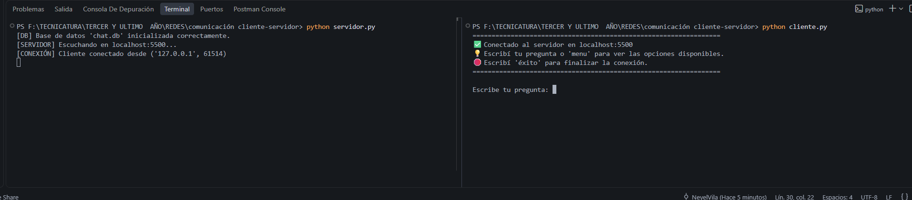
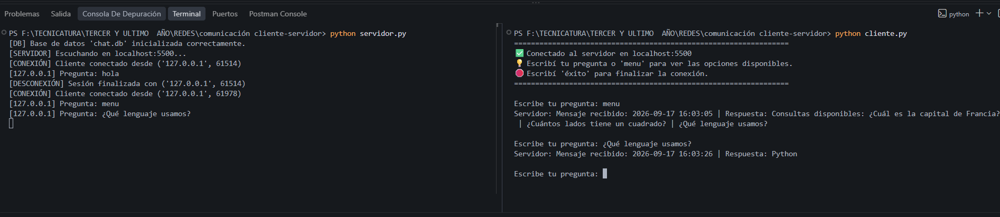
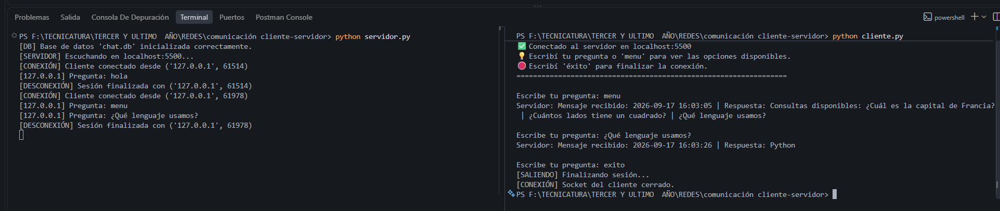
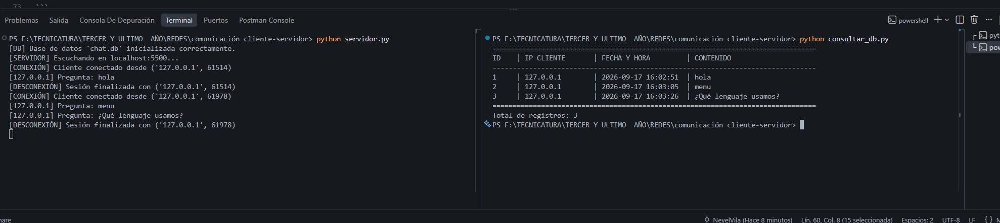

# TP: Chat Cliente-Servidor con Sockets y SQLite

Trabajo Práctico correspondiente a la Propuesta Formativa Obligatoria.
Implementación de una arquitectura cliente-servidor orientada a conexión (TCP) con manejo concurrente de clientes mediante multihilos (`threading`) y persistencia estructurada en base de datos relacional SQLite (`sqlite3`).

---

### Servidor (`servidor.py`)

- **Escucha en `localhost:5500`** mediante socket TCP (`AF_INET`, `SOCK_STREAM`).
- **Funciones modulares:**
  - `inicializar_socket()`: Configuración de opciones (`SO_REUSEADDR`), enlace (`bind`) y puesta en escucha (`listen`).
  - `inicializar_db()`: Creación automática de la tabla `mensajes`
  - `guardar_mensaje()`: Inserción parametrizada con control de concurrencia (`threading.Lock`) para evitar bloqueos en SQLite.
  - `aceptar_conexiones()` y `atender_cliente()`: Asignación de un hilo por cliente (`threading.Thread`) y soporte de difusión en tiempo real (_broadcast_).
  - **Manejo de errores:** Detección de puerto ocupado (`EADDRINUSE` / `errno 98`), fallos de acceso o permisos a la base de datos, y desconexiones abruptas de clientes.
  - **Confirmación al cliente:** Envía la respuesta exacta solicitada: `"Mensaje recibido: <timestamp>"`.

### Cliente (`cliente.py`)

- Conexión al servidor en `localhost:5500`.
- Envío continuo de múltiples mensajes.
- Finalización de sesión al escribir `éxito` (o `exito`).
- Escucha asíncrona mediante un hilo dedicado: muestra inmediatamente la confirmación del servidor y los mensajes difundidos por otros clientes sin bloquear el prompt del usuario.

### Base de Datos (`chat.db`)

Estructura de la tabla `mensajes`:

- `id` (INTEGER PRIMARY KEY AUTOINCREMENT)
- `contenido` (TEXT NOT NULL)
- `fecha_envio` (TEXT NOT NULL)
- `ip_cliente` (TEXT NOT NULL)

---

## 🚀 Guía de Ejecución Local

### 1. Iniciar el Servidor

En una terminal:

```bash
python servidor.py
```

### 2. Conectar uno o varios Clientes

En otra(s) terminal(es) independiente(s):

```bash
python cliente.py
```

### 3. Verificar el Guardado en la Base de Datos

Podés consultar los mensajes registrados ejecutando:

```bash
python consultar_db.py
```

O directamente con la CLI de SQLite:

```bash
sqlite3 chat.db "SELECT * FROM mensajes;"
```

---

## 📁 Estructura del Proyecto

```
chat_sockets_sqlite/
├── servidor.py          # Lógica principal del servidor concurrente y sockets
├── cliente.py           # Cliente interactivo multihilo
├── consultar_db.py      # Script utilitario para consultar y auditar la BD
├── README.md            # Documentación técnica completa
└── chat.db              # Base de datos SQLite (se genera automáticamente)
```

## Imagenes de funcionamientos

### Servidor y Cliente






